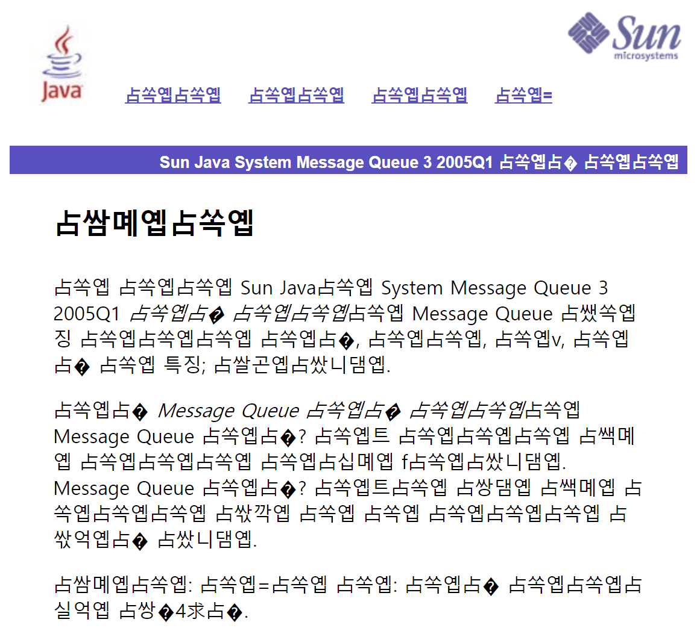
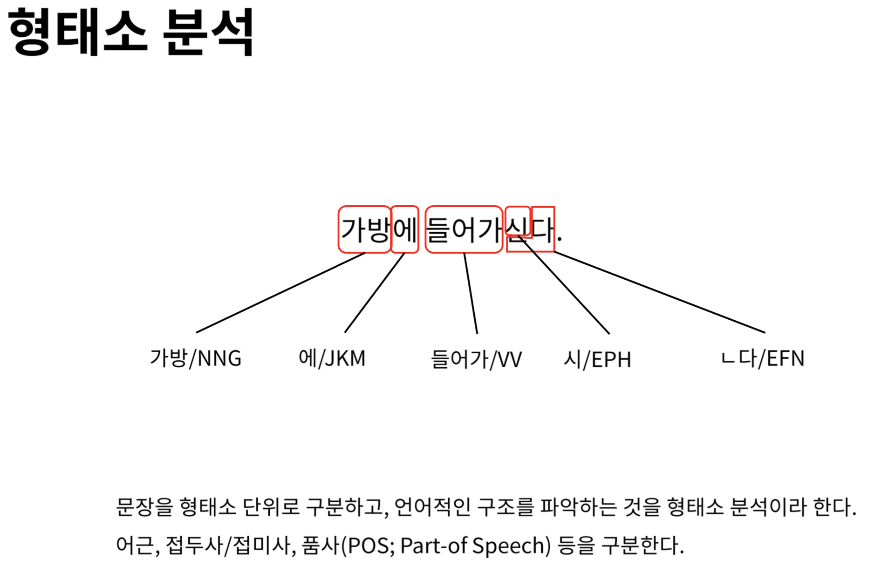
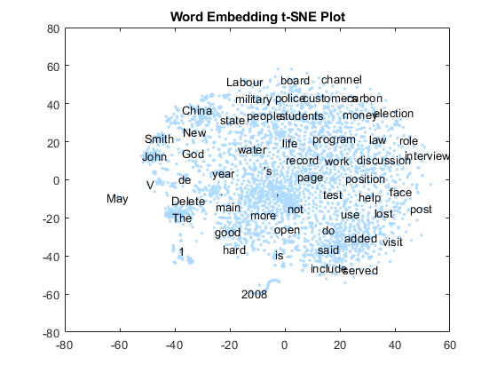
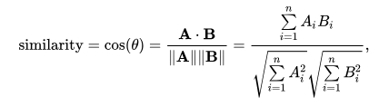
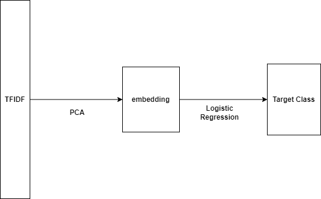
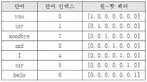
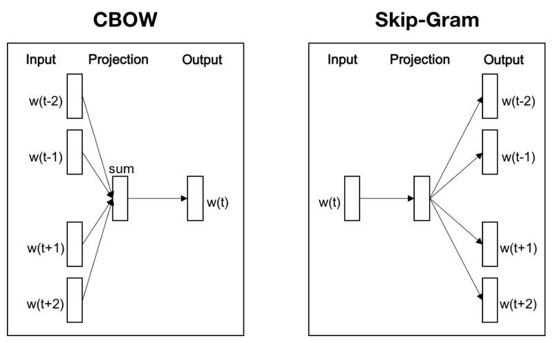
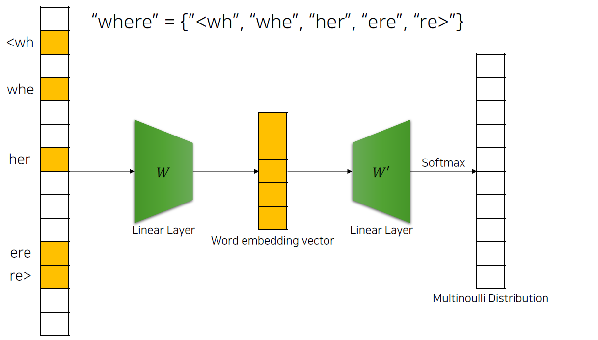
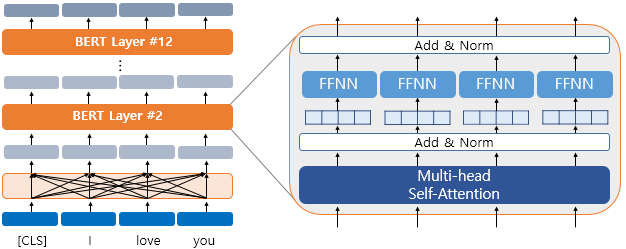
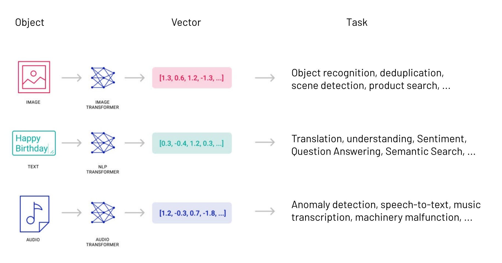

```{r setup, include=FALSE}
knitr::opts_chunk$set(echo = FALSE)
```
<style>
@import url('https://fonts.googleapis.com/css2?family=Noto+Sans+KR:wght@100;300;400;500;700;900&display=swap');

@font-face {
    font-family: 'NEXON Lv1 Gothic OTF';
    src: url('https://cdn.jsdelivr.net/gh/projectnoonnu/noonfonts_20-04@2.1/NEXON Lv1 Gothic OTF.woff') format('woff');
    font-weight: normal;
    font-style: normal;
}

@font-face {
    font-family: 'GongGothicMedium';
    src: url('https://cdn.jsdelivr.net/gh/projectnoonnu/noonfonts_20-10@1.0/GongGothicMedium.woff') format('woff');
    font-weight: normal;
    font-style: normal;
}
@font-face {
    font-family: 'GongGothicBold';
    src: url('https://cdn.jsdelivr.net/gh/projectnoonnu/noonfonts_20-10@1.0/GongGothicBold.woff') format('woff');
    font-weight: normal;
    font-style: normal;
}
@font-face {
    font-family: 'GongGothicLight';
    src: url('https://cdn.jsdelivr.net/gh/projectnoonnu/noonfonts_20-10@1.0/GongGothicLight.woff') format('woff');
    font-weight: normal;
    font-style: normal;
}

@font-face {
    font-family: 'ONE-Mobile-Regular';
    src: url('https://cdn.jsdelivr.net/gh/projectnoonnu/noonfonts_2105_2@1.0/ONE-Mobile-Regular.woff') format('woff');
    font-weight: normal;
    font-style: normal;
}
@font-face {
    font-family: 'ONE-Mobile-Title';
    src: url('https://cdn.jsdelivr.net/gh/projectnoonnu/noonfonts_2105_2@1.0/ONE-Mobile-Title.woff') format('woff');
    font-weight: normal;
    font-style: normal;
}

@font-face {
    font-family: 'PyeongChang';
    src: url('https://cdn.jsdelivr.net/gh/projectnoonnu/noonfonts_2206-02@1.0/PyeongChang.woff2') format('woff2');
    font-weight: normal;
    font-style: normal;
}

@font-face {
    font-family: 'PyeongChang-Bold';
    src: url('https://cdn.jsdelivr.net/gh/projectnoonnu/noonfonts_2206-02@1.0/PyeongChang-Bold.woff2') format('woff2');
    font-weight: normal;
    font-style: normal;
}
</style>
```{css css-settings, echo=FALSE}
* {
  font-family: 'PyeongChang', 'Noto Sans KR', sans-serif;
}

.reveal h1,
.reveal h2,
.reveal h3,
.reveal h4,
.reveal h5,
.reveal h6 {
  font-family: 'GongGothicLight', 'Noto Sans KR', sans-serif;
}

.reveal .slide {
  font-family: 'ONE-Mobile-Regular', 'Nexon Lv1 Gothic OTF', 'Noto Sans KR', sans-serif;
}

.reveal .author {
  font-family: 'Nexon Lv1 Gothic OTF', 'Noto Sans KR', sans-serif;
}
.reveal .date {
  font-family: 'Nexon Lv1 Gothic OTF', 'Noto Sans KR', sans-serif;
}
```

# 한국어 임베딩과 R언어

**요약**

<center>과거의 한국어 자연어처리와 텍스트마이닝에 대해서 돌아보고   
현재 워드임베딩을 중심으로 바뀐 자연어처리 패러다임과 함께  
R에서 사용가능한 관련 패키지와 방법에 대해 간단하게 소개합니다</center>

# 내용 contents

- 한국어 자연어처리와 텍스트마이닝의 어려운점
- 자연어처리의 새 패러다임 워드임베딩

# 한국어 자연어처리 - 과거

과거 3가지 문제가 있었음

- 글자의 문제 (인코딩의 문제)
- 한국어 언어구조의 문제
- 연구를 위한 지원과 자료 부족의 문제



# 한국어 자연어처리 - 현재

**지금은**

- 글자의 문제 (인코딩의 문제) ➡️ UTF-8로 해결됨
- 한국어 언어구조의 문제 ➡️ 포기
- 연구를 위한 지원과 자료 부족의 문제 ➡️ 나아졌지만 영어권에 비해서 부족

# R로 하는 한국어 자연어처리?

**미리 말하는 결론**

- R은 텍스트 데이터를 처리하는데 매우 불리
- Python은 좀 낫지만 여전히 불리
- 다른 컴퓨터랭귀지도 마찬가지
- 컴퓨터랭귀지 문제가 아니라 비정형 데이터와 자언어의 문제
- 워드임베딩은 자연어에 비교적 비의존적으로 텍스트마이닝이 가능

# 한국어 자연어처리 - 형태소분석기

한국어를 위한 아주 좋은 형태소분석기, 구문분석기가 많지 않음

- 은전한닢(MeCab), 노리(Nori), 꼬꼬마(Kkma), 한나눔(Hannanum), OKT, Soynlp, 구글 센텐스피스 (Google Sentence Piece)
  - 기계학습(HMM, CRF) 기반
  - 21세기세종계획 + 각자의 추가 말뭉치
- 규칙기반(rule base)의 형태소분석기는 현재는 많이 쓰이지 않음
  - 처리 속도가 빠르고 매우 깔금한 결과가 도출됨
  - 룰(문법)을 고치기가 매우 어려움
  - 신조어, 문법파괴, 예외사항에 취약

# 한국어 자연어처리 - 형태소분석기



[그림 출처](https://heung-bae-lee.github.io/2020/01/19/NLP_02/)

# 한국어 자연어처리 - 구문분석기

**구문분석기 (Language Parser)**

- 입력된 문장을 파싱해서 **트리구조**로 분석
- 주어, 목적어, 서술어 등을 찾을 수 있음

"아버지가 식사를 하신다"  
"아버지가" ➡️ 주어 / "식사를" ➡️ 목적어 / "하신다" ➡️ 서술어


# 한국어 자연어처리 - 개체명인식기

**개체명인식기 (NER, Named Entity Recognition)**

개체명: 제품명, 지명, 인명, 기관명, 회사명, 브랜드명, 이메일, URL, 전화번호?

```text
기생충은 스토리 만으로도 훌륭하고 일상 코메디 물과 어찌보면 스릴러가 함께 잘 혼합된 영화라고 볼 수 있습니다. 
그러나 이야기를 관통하고 많은 장면에서 보이는 계단을 통해 사회적인 높낮이와 실질적인 장소로서의 높낮이로 이야기를 풀어가고 있습니다. 
...
```


[그림 출처](https://github.com/songys/entity)

# 한국어 자연어처리 - 띄어쓰기 문제 #1

<center>**형태소분석기는 세그멘테이션은 할 수 있음**</center>

`아버지가방에들어가신다` ➡️ `아버지가 방에 들어가신다`

<center>**형태소분석기는 분리된 것을 결합하지는 않음**</center>

`아버지 가방을 고쳐드렸다` ➡️ `아버지가방을 고쳐드렸다`

- 처리하려면 별도의 구현이 필요하지만 매우 복잡하고 어려움
- 사용자사전은 세그먼테이션 방지만 가능, 붙이는 것은 별도 구현

# 한국어 자연어처리 - 띄어쓰기 문제 #2

형태소분석기의 세그멘테이션과 문법상 띄어쓰기는 사실 다름

- 형태소분석: `무궁화_꽃_이_피었_습니다`
- 띄어쓰기: `무궁화꽃이_피었습니다`

세그멘테이션은 검색을 위한 인덱서로 많이 사용했던 경향이 있음

# 한국어 자연어처리의 장벽 - 복합명사 #1

**개체명(Named Entity)**의 예

- 이상한 변호사 우영우
- 오징어게임
- 탑건2 매버릭
- 카라마조프가의 형제들
- 추락하는 것은 날개가 있다

**문제**

- 책이나 영화제목 등의 문장으로 된 개체명은 처리하기 어려움
- 영어에서도 처리하기 어렵기는 마찬가지

# 한국어 자연어처리의 장벽 - 복합명사 #2

- 대한민국은 민주주의 공회국이다.
- 한국R사용자커뮤니티는 R을 사용하는 사람들의 커뮤니티이다.
- Apple 아이폰 13 mini 자급제, 128GB, 미드나이트
- 삼성전자 갤럭시 S22 자급제 SM-S901N, 256GB, 보라퍼플
- LA갈비, 왕할머니손칼국수
- 샤넬 코코 크렘 뿌르르꼬르 바디 크림

# 한국어 자연어처리의 장벽 - Corpus(말뭉치)

자연어처리를 위한 기계학습, 전산언어연구를 하기 위한 자료와 지원 부족

- 모두의 말뭉치(21세기세종계획)
- 위키피디아
- 빅테크 회사들의 기여 자료
- 그외의 자료들 (크롤링, 기업체 자체 수집 후 공개)

# 자연어처리 결과의 응용

- 단어가방 기반의 기계학습, 마이닝 알고리즘 적용
  - 워드클라우드, 연관 단어 추출, 공빈발단어추출
- 문서 군집화, 분류
  - 중복문서제거, 토픽모델링, 표절방지, 자동문서분류

# 자연어처리 결과의 응용 - 워드클라우드

**워드클라우드 wordcloud**

- 출현한 단어의 빈도, 상대빈도로 텍스트의 크기를 다르게 시각화한 것
- 무수히 많은 문서에서 공통으로 나오는 단어는 중요한 단어로 간주
  - 단어의 중요도는 빈도가 아닌 다른 값을 사용할 수도 있음
- 가장 널리 알려진 빅데이터의 예제


# 자연어처리 결과의 응용 - 워드클라우드 문제 #1

- 형태소분석기에 의존적
  - 한국어는 조사와 접미사를 제거하고 명사만 뽑아내는 작업이 필요
  - 단어를 어떻게 세그먼테이션 하는가에 따라 다른 인사이트가 나옴
- 불용어처리가 필요
  - 조사, 접미사, 불용어 등은 문장으로 묶어주지 않으면 의미 해석에 방해

# 자연어처리 결과의 응용 - 워드클라우드 문제 #2

**자원소모가 많고 수고가 많이 드는 작업**

- 대량의 문서에서 단어의 빈도를 추출하는 것은 분산컴퓨팅이 필요
  - 적은 양의 문서에서 추출한 단어의 빈도로는 인사이트가 보이지 않음
  - 또는 편향된 인사이트를 얻음 (특정 커뮤니티, 특정 성향의 뉴스 매체 댓글)
- R, Python, C++, Java 어떤 언어를 사용해도 노트북에서 처리하기는 어려움
- 단어의 빈도를 추출하는 것은 분산컴퓨팅 플랫폼을 사용하고 분석과 시각화는 따로 작업

# 자연어처리 결과의 응용 - 워드클라우드 문제 #3

**꿈보다는 해몽**

- 해석하는 사람의 역랑에 따라 인사이트가 달라짐
  - 자신에게 유리한 쪽으로 해석하고 보고 싶은 것만 보고 싶어함
- 좋은 인사이트를 얻기 위해서는 도메인지식이 필요함
- 도메인에 따른 주변지식도 필요함


# 자연어처리 결과의 응용 - 워드클라우드 문제 #4

- 워크클라우드 생성은 자동화가 가능하고 쉽지만
- 해석은 자동화가 되지 않음


# 자연어처리 결과의 응용 - t-SNE
      
t-SNE는 고차원의 데이터를 저차원으로 줄여서 표현



# 자연어처리 결과의 응용 - 클러스터링

자연어처리를 위해서 유사문서, 중복문서를 묶는데 클러스터링을 사용

- 최근 어떤 문서(UGC)들이 주로 생성되는가?
  - 뉴스, 블로그 콘텐츠, SMS, 댓글
- 최근 어떤 문서들이 많이 소비되는가?
  - 글 조회수, 좋아요 수, 댓글 수, 공유 수

# 자연어처리 결과의 응용 - 클러스터링 문제 #1

- 문서의 볼륨이 클수록 많은 컴퓨터자원이 필요함
- 결과물을 응용해서 비즈니스에 적용하기 어려움
  - 가치화 문제 (Monetization)

# 자연어처리 결과의 응용 - 클러스터링 문제 #2

- 생각보다 잘 되지 않는 클러스터링
- 의미중심의 클러스터링이 아닌 단어매치 기반에 의한 클러스터링
  - TF-IDF와 코사인유사도(Cosine Similarity)만으로는 어려움

# 자연어처리 결과의 응용 - 클러스터링 거리측정

거리측정 (Distance Measure)

- 유클리디안 거리 (Euclidean Distance)
- 코사인 유사도 (Cosine Similarity)
  - 워드임베딩의 검색 및 군집화에 주로 사용



# 자연어처리 결과의 응용 - 학습데이터의 부족

- 자언어처리 모델을 만드는데 필요한 코퍼스가 부족
- 각 산업별, 기업별 자료들이 공개되지 않고 폐쇠적으로 활용
- 수집된 오픈데이터(크롤)도 공개가 되지 않음
  - 저작권 문제?

# 지금까지의 자연어처리의 문제

- 온톨로지의 실패 ➡ 의미, 추론 기반으로 발전 실패
- 형태소분석기와 구문분석기의 보편화 실패
  - 빅테크 회사들 내에서만 독점적으로 사용하고 관리
  - 빈익빈 부익부

# 텍스트(자언어)를 인코딩하는 2가지 기본 방법

- TF-IDF 벡터라이즈
- 원핫인코딩(One hot encoding)

# 텍스트를 인코딩하는 방법 - TFIDF

**Term Frequency Inverse Document Frequency**

- TF: 토큰의 갯수
- DF: 토큰의 출현한 고유 문서 수
- 공식: TF x IDF
- 정보검색에 적합함

# 텍스트를 인코딩하는 방법 - TFIDF


[그림 출처](https://towardsdatascience.com/tf-term-frequency-idf-inverse-document-frequency-from-scratch-in-python-6c2b61b78558)

# TFIDF - R패키지 tidytext

```r
ibrary(dplyr)
library(janeaustenr)
library(tidytext)

book_words <- austen_books() %>%
  unnest_tokens(word, text) %>%
  count(book, word, sort = TRUE)

total_words <- book_words %>% 
  group_by(book) %>% 
  summarize(total = sum(n))

book_words <- left_join(book_words, total_words)
# ...
# 이하 생략. 코드가 조금 길지만 명료함
# ...
```

[tidytext](https://www.tidytextmining.com/tfidf.html)

# 언어를 인코딩하는 2가지 기본 방법 - TFIDF (superml 패키지)

```r
library(superml)
sents <-  c('i am going home and home',
          'where are you going.? //// ',
          'how does it work',
          'transform your work and go work again',
          'home is where you go from to work')
sents <- rep(sents, 10) 
tfv <- TfIdfVectorizer$new(max_features = 10, remove_stopwords = FALSE)
tf_mat <- tfv$fit_transform(sents)
head(tf_mat, 3)
#>      work      home       you     where     going go       and your transform
#> [1,]    0 0.8164966 0.0000000 0.0000000 0.4082483  0 0.4082483    0         0
#> [2,]    0 0.0000000 0.5773503 0.5773503 0.5773503  0 0.0000000    0         0
#> [3,]    1 0.0000000 0.0000000 0.0000000 0.0000000  0 0.0000000    0         0
#>      to
#> [1,]  0
#> [2,]  0
#> [3,]  0
```

[superml](https://cran.r-project.org/web/packages/superml/vignettes/Guide-to-TfidfVectorizer.html)

# 언어를 인코딩하는 2가지 기본 방법 - TFIDF Classification



# 언어를 인코딩하는 2가지 기본 방법 - 원핫인코딩

**원핫인코딩 (One hot encoding)**

**"무궁화 꽃이 피었습니다"**

| 단어 | 인덱스 | 원핫벡터 |
|------|--------|----------|
| 무궁화 |   0    |  1 0 0 |
| 꽃이   |   1    |  0 1 0 |
| 피었습니다 | 2 |  0 0 1 |



# 워드임베딩 word embedding

- 단어를 밀도가 높은 벡터로 표현하는 방법
  - 인코딩한 고차원의 워드벡터를 낮은 차원의 벡터로 축소하는 방법
- 지정한 윈도우 내의 모든 단어(토큰)을 원핫벡터로 바꿈

원문: "자율주행 자동차는 기계가 스스로 운행하는 자동차를 말한다."

# TF-IDF와 word2vec 계열의 차이

- TF-IDF: Bag of Words (단어가방), 주변단어를 고려하지 않음
  - "속도 위반", "위반 속도"
- word2vec:
  - 주변 단어를 고려함

# 워드임베딩 word embedding

**워드임베잉 Word Embedding**이란?

- 단어를 밀도높은 수열(숫자)로 만드는 기술
  - 원핫 인코딩을 하고 차원축소로 임베딩을 함
  - 단어를 의미를 잘 내포하는 벡터로 만드는 기술
- 딥러닝(Deep Learning)을 이용한 자언어처리에서는 현재 주류(대세)
  - 원핫인코딩을 사용하지 않을 수도 있음

# 워드임베딩 word embedding


# 워드임베딩의 장점

- 대량의 학습데이터로 높은 성능의 모델을 쉽게 만들 수 있음
- 형태적 매치 보다는 의미 매치에 가까운 모델을 만달 수 있음
- 모델을 빌드하는데 인간의 고민이 덜 필요함
- 사전학습모델(pre-trained model)을 이용하고 전이학습(transfer learning) 가능

# 워드임베딩의 단점

- 많은 컴퓨터 계산 자원이 필요함 (특히 GPU)
- 많은 학습데이터가 필요함 (적으면 성능이 낮아짐)
- 블랙박스(Blackbox Model)
  - 의도한 대로 만들어지지 않을 수 있음
  - 예상 밖의 결과가 나오는 경우가 많음

# 워드임베딩의 전이학습

- 빌드한 워드임베딩모델을 분류 모델 같은 것에 활용
- 학습데이터가 부족할 때 사용
- pre-trained model -> fine-tuning

# 알려진 워드임베딩 기법

- Word2Vec
- GLoVe
- ELMo
- FastText
- BERT
- Big Bird

# 워드임베딩 - word2vec

- 2013년 구글 리서팀이 발표
- 신경망 모델 (Neural Network Model)
- 딥러닝 (Deep learning) (x)

# 워드임베딩 - word2vec - CBOW와 skip-gram



# 워드임베딩 - word2vec R패키지

```r
brary(wordVectors)
library(readr)
model = train_word2vec(train_file = "./word2vec/RecData.txt"
                       , threads=3
                       , vectors=100
                       , force = T
                       , window = 6
                       , output_file = "./word2vec/word2vec_model.bin")        
model = wordVectors::read.binary.vectors("./word2vec/word2vec_model.bin")
result <- nearest_to(model, model[["마케팅"]], 20)
result
```

# 워드임베딩 - word2vec R패키지

```r
library(tidytext)
library(dplyr)
# We want to use original tweets, not retweets:
elected_no_retweets <- elected_official_tweets %>%
  filter(is_retweet == F) %>%
  select(c("text"))
#create tweet id
elected_no_retweets$postID<-row.names(elected_no_retweets)
# ... 생략 ...
```

[코드 출처](https://cbail.github.io/textasdata/word2vec/rmarkdown/word2vec.html)

# 워드임베딩 - GLoVE

- GLoVe (Global Vectors for Word Representation)
- Word2Vec, LSA(Latent Semantic Analysis)의 단점을 보완
- 동시등장행렬 (Co-oocurrence Matrix)을 사용
- 고차원 행렬연산(Matrix Factorization)이 부담

# 워드임베딩 - GLoVE R패키지

[text2vec](https://cran.r-project.org/web/packages/text2vec/vignettes/glove.html#Word_embeddings)

```r
library(text2vec)
text8_file = "~/text8"
if (!file.exists(text8_file)) {
  download.file("http://mattmahoney.net/dc/text8.zip", "~/text8.zip")
  unzip ("~/text8.zip", files = "text8", exdir = "~/")
}
wiki = readLines(text8_file, n = 1, warn = FALSE)
tokens <- space_tokenizer(wiki)
it = itoken(tokens, progressbar = FALSE)
vocab <- create_vocabulary(it)
vocab <- prune_vocabulary(vocab, term_count_min = 5L)
vectorizer <- vocab_vectorizer(vocab)
tcm <- create_tcm(it, vectorizer, skip_grams_window = 5L)
glove <- GlobalVectors$new(rank = 50, x_max = 10)
wv_main <- glove$fit_transform(tcm, n_iter = 10, convergence_tol = 0.01, n_threads = 8)
wv_context <- glove$components
word_vectors <- wv_main + t(wv_context)
```

# 워드임베딩 - fastText

- 페이스북 리서치팀에서 만든 서브워드를 지원하는 임베딩 모델
- 서브워드를 사용하기 때문에 자연어 의존성이 매우 적음
- GPU가 없어도 매우 빠름 (사실 GPU는 지원하지 않음)

# 워드임베딩 - fastText R패키지

```r
library(fastText)
list_params = list(command = 'cbow', lr = 0.1, dim = 50, 
                   input = "example_text.txt",
                   output = file.path(tempdir(), 'word_vectors'), 
                   verbose = 2, thread = 1)
res = fasttext_interface(list_params, 
                         path_output = file.path(tempdir(), 'cbow_logs.txt'),
                         MilliSecs = 5, remove_previous_file = TRUE,
                         print_process_time = TRUE)
```

[fastText](https://github.com/mlampros/fastText)

# 워드임베딩 - fastText 서브워드



# 워드임베딩 - BERT

- BERT(Bidirectional Encoder Representations from Transformers)
- 트랜스포머의 단순화 버전
- BERT는 토큰임베딩, 세그먼트임베딩, 포지션임베딩으로 구성되어 있음
- 현재까지 의미벡터를 만드는 방법 중 가장 좋은 성능을 보임
  - SOTA (State of the Art)

# BERT



[그림 출처](https://wikidocs.net/115055)

# BERT - 토큰임베딩 Token Embeddings

- 워드피쓰(Word piece) 임베딩 방식을 사용
  - 자주 등장하는 가장 긴 길이의 sub-word을 하나의 단위로 사용
  - 자주 등장하는 단어(sub-word)는 그 자체가 단위가 되고, 자주 등장하지 않는 단어(rare word)는 더 작은 sub-word로 분할
  - 자주 등장하지 않은 단어가 전부 Out-of-vocabulary(OOV)가 되는 성능 저하의 원인을 해결.
  - 입력 문장의 시작과 끝으로 [CLS], [SEP] 토큰을 지정.
    - [CLS] (special classification token) 토큰은 시퀀스 결합의 의미
    - 또한 문장의 구분을 위해 문장의 끝에 [SEP] 토큰을 사용 합니다.

# BERT - 세그먼트임베딩 Segment Embeddings

- 토큰으로 나누어진 단어들을 다시 하나의 문장으로 만듦
- 첫 번째 [SEP] 토큰까지는 0, 그 외 [SEP] 토큰은 1로 마스킹해서 문장을 구별

# BERT - 포지션임베딩 Position Embeddings

- 토큰의 순서를 인코딩
- BERT는 transformer의 encoder를 사용하는데 Transformer는 Self-Attention 모델을 사용
- Self-Attention은 입력의 위치에 대해 고려하지 못하므로 입력 토큰의 위치 정보 주어야 함
- Transformer 에서는 Sigsoid 함수를 이용한 Positional encoding을 사용하지만
- BERT에서는 이를 변형하여 Position Encodings을 사용
- 앞서 언급한 각 임베딩들의 토큰 별로 모두 더하여 BERT의 입력 벡터로 사용합니다.

# BERT R패키지

RStudio의 Keras 패키지를 사용하여 BERT를 사용할 수 있음

```r
Sys.setenv(TF_KERAS=1) 
# make sure we use python 3
reticulate::use_python('C:/Users/turgut.abdullayev/AppData/Local/Continuum/anaconda3/python.exe',
                       required=T)
# to see python version
reticulate::py_config()
```

# 워드벡터의 활용 - 같은 방법 다른 결과

여전히 과거의 방법과 동일한 방법을 시도

- 분류(Classification)
  - 신경망(Neural Network), SVM, Knn
- 군집화(Clutering)
  - K-means, DBSCAN

※ 예전에도 하던 것들이지만 더 그럴듯한 쓸만한 결과가 나옴

# 워드벡터의 활용 - 의미기반 처리가 잘 되지 않음

- 의미기반의 문서 검색 (Semantic Search)
  - 유사한 명칭찾기 
  - 짜장면 가게 =? 짬뽕 가게
- 의미 기반의 문서 분류 (Semantic Document Classification)
- 감성분류 (Sentiment analysis)

# 워드벡터의 활용 - 벡터검색



[그림 출처](https://www.pinecone.io/learn/vector-search-basics/)

# 워드벡터 활용을 위한 유용한 도구

- 고속벡터검색엔진
  - Milvus, ElasticSearch, Vespa, Faiss

[awesome vector search 참조](https://github.com/currentslab/awesome-vector-search)

# R언어로 자연어처리를 할 때? - 어떻게 접근할까?

워드임베딩을 사용해야 하나? TFIDF벡터라이즈를 사용해야 하나?


# R언어로 워드임베딩을 할 때 고려할 것 #1

- 어떤 모델을 사용할까?
  - 문제를 해결하는데 가장 적합한 솔루션을 사용
  - 가장 좋은 솔루션 보다는 가장 효율적인 솔루션
  - 좋은 것을 원하면 그냥 BERT를 쓰면 됨
- 입력 데이터 특징과 양상에 대한 확인
  - 장문인가? 단문인가? 초단문인가?
  - 문법파괴, 언어파괴가 심한가 아닌가?
    - 뉴스 매체테의 텍스트는 문법파괴와 맞춤법 오류가 거의 없음
    - SNS, 채팅 텍스트는 문법파괴와 맞춤법 오류가 많음

# R언어로 워드임베딩을 할 때 고려할 것 #2

- 모델을 R에서 빌드 할 것인가?
  - R에서 빌드가 가능한 모델 구현체 패키지를 입수하거나 만들어야함
  - 꼭 그럴 필요가 있는지 고민
  - 최근 많은 기계학습 프레임워크는 모델 빌더를 제공함
- 빌드된 모델로 결과를 해석하고 응용하는 것만 할 것인가?
  - 빌드된 모델을 로딩해서 사용가능한 패키지가 있어야 함
  - 일부는 있고 일부는 없음
- 응용한 결과로 처리된 데이터로 인사이트를 얻는 것만 할 것인가?
  - 기존의 데이터분석, 데이터과학과 다를 것이 없음

# R언어로 자연어처리, 텍스트마이닝을 할 때

- 모델이 제공하는 기본 툴킷을 가능한 많이 이용
- 모든 것을 R로 하려하는 집착을 버릴 것
  - 기계학습, 텍스트처리 솔루션은 이제 랭귀지 의존적이라고 보기 어려움

# 자연어처리의 미래?

- 고성능 자동화는 현재 신경명, 딥러닝이 주류
- 여전히 인사이트를 얻고 판단하는 것은 사람의 몫

# END

Question? Answer!
