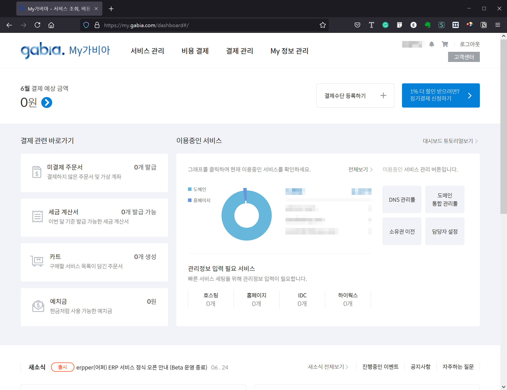
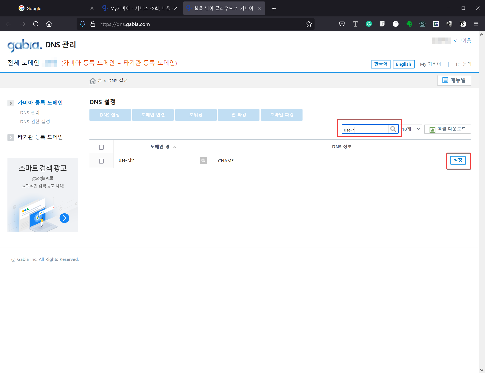
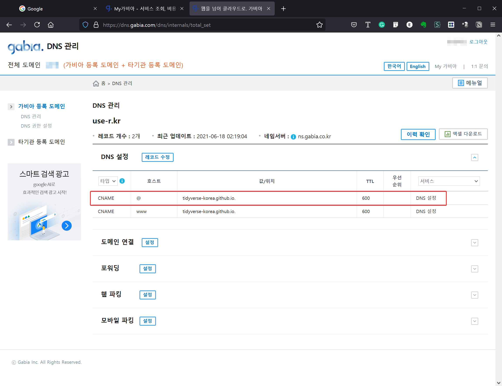
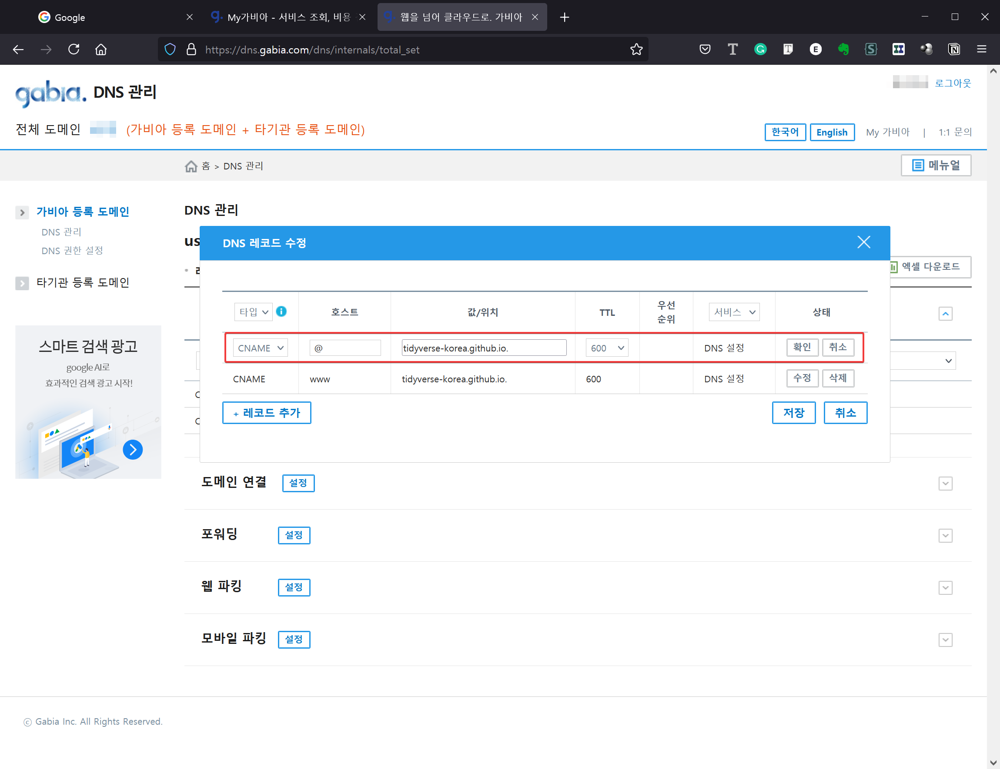

```{r setup, include=FALSE}
knitr::opts_chunk$set(echo = FALSE)
```
<style>
@import url('https://fonts.googleapis.com/css2?family=Noto+Sans+KR:wght@100;300;400;500;700;900&display=swap');

@font-face {
    font-family: 'NEXON Lv1 Gothic OTF';
    src: url('https://cdn.jsdelivr.net/gh/projectnoonnu/noonfonts_20-04@2.1/NEXON Lv1 Gothic OTF.woff') format('woff');
    font-weight: normal;
    font-style: normal;
}

@font-face {
    font-family: 'GongGothicMedium';
    src: url('https://cdn.jsdelivr.net/gh/projectnoonnu/noonfonts_20-10@1.0/GongGothicMedium.woff') format('woff');
    font-weight: normal;
    font-style: normal;
}
@font-face {
    font-family: 'GongGothicBold';
    src: url('https://cdn.jsdelivr.net/gh/projectnoonnu/noonfonts_20-10@1.0/GongGothicBold.woff') format('woff');
    font-weight: normal;
    font-style: normal;
}
@font-face {
    font-family: 'GongGothicLight';
    src: url('https://cdn.jsdelivr.net/gh/projectnoonnu/noonfonts_20-10@1.0/GongGothicLight.woff') format('woff');
    font-weight: normal;
    font-style: normal;
}

@font-face {
    font-family: 'ONE-Mobile-Regular';
    src: url('https://cdn.jsdelivr.net/gh/projectnoonnu/noonfonts_2105_2@1.0/ONE-Mobile-Regular.woff') format('woff');
    font-weight: normal;
    font-style: normal;
}
@font-face {
    font-family: 'ONE-Mobile-Title';
    src: url('https://cdn.jsdelivr.net/gh/projectnoonnu/noonfonts_2105_2@1.0/ONE-Mobile-Title.woff') format('woff');
    font-weight: normal;
    font-style: normal;
}
</style>
```{css css-settings, echo=FALSE}
.reveal h1,
.reveal h2,
.reveal h3,
.reveal h4,
.reveal h5,
.reveal h6 {
  font-family: 'GongGothicLight', 'Noto Sans KR', sans-serif;
}

.reveal .slide {
  font-family: 'ONE-Mobile-Regular', 'Nexon Lv1 Gothic OTF', 'Noto Sans KR', sans-serif;
}

.reveal .author {
  font-family: 'Nexon Lv1 Gothic OTF', 'Noto Sans KR', sans-serif;
}
.reveal .date {
  font-family: 'Nexon Lv1 Gothic OTF', 'Noto Sans KR', sans-serif;
}
```

내용
========================================================

- 배경설명
- 준비물
- 도메인 설정하기
- Github 설정하기
- 확인하기

배경 설명
========================================================

- R로 작성한 문서를 HTML로 만들고 서비스를 하려면 서버 또는 VPS 호스팅이 필요함
- 호스팅 서비스를 이용하는데 비용을 지불해야함
- 호스팅 자원을 관리하는데 시간과 노력도 필요함
- 비용과 노력을 최소화해서 정적인 HTML을 서비스할 수 있는 방법을 Github이 제공하고 있음
- 과거 10여년 동안 많은 과학자, 데이터 분석가, 개발자들이 이 방법을 이용해 왔음
- 아직까지 가장 저렴하면서 쉬운 방법은 Github + Domain 설정 변경

준비물
========================================================

**도메인**

- 구매하거나 이미 소유하고 있는 것을 사용
- 구매 비용은 .com도메인은 1년에 13,500원 (가비아 기준)

**Github 레파지토리**

- Github 계정이 없으면 하나 새로 생성해야 함
- 도메인을 연결할 Public 레파지토리를 생성
- 예전에는 "tidyverse-kr.github.io" 와 같은 정해진 이름 규칙이 있었지만 지금은 아님
- Private은 도메인을 연결할 수 없음

간략한 순서 요약
========================================================

1. 도메인 레코드 설정하기 
2. Github 레파지토리 설정하기
3. 초기 HTML 파일 업로드하기
4. 확인하기

도메인 설정 하기 - 요약
========================================================

- 도메인에 CNAME 레코드를 추가 또는 변경하기
- 소유한 도메인의 레지스타별로 DNS 레코드 수정하는 화면과 방법이 다름
- 각 도메인의 레지스타의 도움말 또는 문서를 참고해야 함


도메인 설정 1
========================================================

{width=600}

도메인 설정 2
========================================================

- 설정을 하려는 도메인을 찾아서 DNS 레코드 설정으로 들어갈 것
- 진입 방법은 레지스트라(registrar)별로 다름
{width=600}


도메인 설정 3
========================================================

- 아래의 화면은 이미 등록된 상태를 보여주는 것
- 처음 하는 것이면 CNAME이 등록되어 있지 않을 것이므로 아래의 화면과 다름

{width=600}


도메인 설정 4
========================================================

- CNAME에 입력할 도메인 주소는 "계정명.github.io."
- 끝에 "."이 붙으므로 주의
- 이 예에서는 "tidyverse-kr"이 github 계정명

{width=600}


github에서 페이지설정 1
========================================================

{width=600}

github에서 페이지설정 2
========================================================

- 웹루트로 사용할 브랜치와 디렉토리를 지정하면 CNAME이라는 파일이 자동으로 생성되서 저장됨
- "Enable HTTPS"를 체크하면 "https://use-kr.com" 과 같이 https로 서비스할 수 있음


{width=600}


확인하기
========================================================

<<<<<<< HEAD
- index.html을 비롯한 내용물을 github 레파지토리에 올림
- 웹브라우저로 접속해서 확인. 적용되는데 최대 5분까지 걸림
- 예시 [https://use-r.kr]()


기타 공유
========================================================

- Knitr와 Rmarkdown을 이용해서 연동하기에 매우 편리함
- Blogdown, Bookdown,...down 시리즈의 결과물을 저장하고 공유하기에 매우 적합함
- 함께 연동할 수 있는 Jeykyl, Hyde, Hugo, Hexo 등 많은 다른 솔루션이 있음


마치며
========================================================

- 이 슬라이드는 Rmarkdown revealjs 형식으로 만든 것입니다.
- 슬라이드 소스는 [여기](https://github.com/aidenhong/aidenhong.github.io/tree/master/presentations/setup-github-for-making-a-static-website)에 있습니다.
- 자료는 마음대로 사용하셔도 됩니다.

=======
- 웹브라우저로 접속해보면 됩니다.
- [https://use-r.kr]()


기타
========================================================

- Knitr와 Rmarkdown을 이용해서 연동하기에 매우 편리함
- 함께 연동할 수 있는 Jeykyl, Hyde, Hugo, Hexo 등 많은 다른 솔루션이 있음


>>>>>>> master
